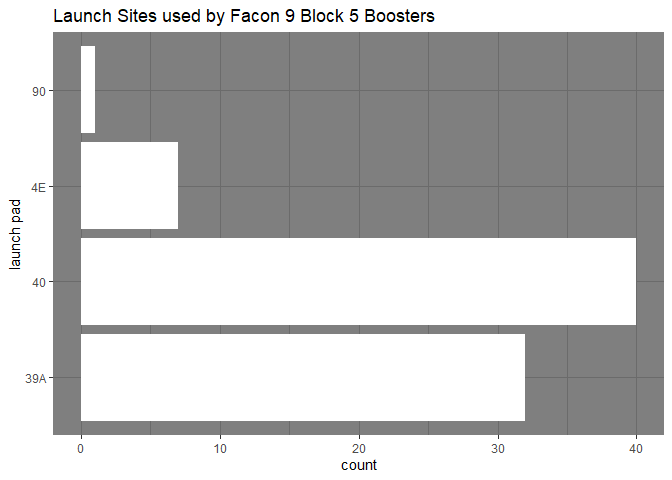

Final Project Part 2
================

In this chunk, we scrape the dataset from Wikipedia.

``` r
url <- "https://en.wikipedia.org/wiki/List_of_Falcon_9_first-stage_boosters#Block_5"

wiki_page <- read_html(url)

BlockFive_dirty <- wiki_page %>%
  html_elements("table") %>%
  .[[1]] %>%
  html_table()

BlockFive_dirty
```

    ## # A tibble: 82 x 10
    ##    `S/N[a]` Type  Launches `Launch date (UTC)[7]` `Flight <U+2116>[b]` `Turnaround tim~
    ##    <chr>    <chr> <chr>    <chr>                  <chr>         <chr>           
    ##  1 B1046    F9    4        11 May 2018            F9-054        N/A             
    ##  2 B1046    F9    4        7 August 2018          F9-060 <U+267A>      88 days         
    ##  3 B1046    F9    4        3 December 2018        F9-064 <U+267A>      118 days        
    ##  4 B1046    F9    4        19 January 2020[11]    F9-079 <U+267A>      412 days        
    ##  5 B1047    F9    3        22 July 2018           F9-058        N/A             
    ##  6 B1047    F9    3        16 November 2018       F9-063 <U+267A>      116 days        
    ##  7 B1047    F9    3        6 August 2019[15]      F9-074 <U+267A>      263 days        
    ##  8 B1048    F9    5        25 July 2018           F9-059        N/A             
    ##  9 B1048    F9    5        8 October 2018         F9-062 <U+267A>      75 days         
    ## 10 B1048    F9    5        22 February 2019       F9-068 <U+267A>      137 days        
    ## # ... with 72 more rows, and 4 more variables: Payload[c] <chr>,
    ## #   Launch (pad) <chr>, Landing(location) <chr>, Status[d] <chr>

Using the janitor package, I made the column names cleaner and renamed
launch date.

``` r
BlockFive_clean <- BlockFive_dirty %>%
  clean_names() 
BlockFive_clean <- BlockFive_clean %>%  rename(`launch date` = `launch_date_utc_7`)
  
BlockFive_clean
```

    ## # A tibble: 82 x 10
    ##    s_n_a type  launches `launch date`  flight_no_b turnaround_time payload_c    
    ##    <chr> <chr> <chr>    <chr>          <chr>       <chr>           <chr>        
    ##  1 B1046 F9    4        11 May 2018    F9-054      N/A             Bangabandhu-~
    ##  2 B1046 F9    4        7 August 2018  F9-060 <U+267A>    88 days         Telkom-4 Mer~
    ##  3 B1046 F9    4        3 December 20~ F9-064 <U+267A>    118 days        SHERPA (SSO-~
    ##  4 B1046 F9    4        19 January 20~ F9-079 <U+267A>    412 days        Dragon C205 ~
    ##  5 B1047 F9    3        22 July 2018   F9-058      N/A             Telstar 19V[~
    ##  6 B1047 F9    3        16 November 2~ F9-063 <U+267A>    116 days        Es'hail 2[14]
    ##  7 B1047 F9    3        6 August 2019~ F9-074 <U+267A>    263 days        Amos-17[16]  
    ##  8 B1048 F9    5        25 July 2018   F9-059      N/A             Iridium NEXT~
    ##  9 B1048 F9    5        8 October 2018 F9-062 <U+267A>    75 days         SAOCOM 1A[18]
    ## 10 B1048 F9    5        22 February 2~ F9-068 <U+267A>    137 days        Nusantara Sa~
    ## # ... with 72 more rows, and 3 more variables: launch_pad <chr>,
    ## #   landing_location <chr>, status_d <chr>

Using the Lubridate Package to add in the dates, also the launches are
now a numeric value

``` r
BlockFive_clean <- BlockFive_clean %>% 
  mutate(`launch date` = str_extract(`launch date`, "[0-9]{1,2}[:space:]{1}[A-Z]{1}[a-z]*[:space:][0-9]{4}"),
         `launch date` = dmy(`launch date`),
         launches = as.numeric(launches))
```

    ## Warning in mask$eval_all_mutate(quo): NAs introduced by coercion

In this chunk, the flight number has been trimmed to get rid of any
unwanted values.

``` r
BlockFive_clean <- BlockFive_clean %>%
  rename(`flight num` = flight_no_b) %>%
  mutate(`flight num` = str_extract(`flight num`, "[F]{1}[9H]{1}[-]{1}[0-9x]{3}"))
```

In this chunk, the turn around time for the boosters have been trimmed
down using str\_extract, and have been converted to a numeric value

``` r
BlockFive_clean <- BlockFive_clean %>%
  mutate(turnaround_time = str_extract(turnaround_time, "[0-9]*"),
         turnaround_time = as.numeric(turnaround_time))
```

launch\_pad was split into two categories; one for the outcome of the
launch and the other for the name of the launchpad.

``` r
BlockFive_clean <- BlockFive_clean %>%
  mutate(`launch outcome` = str_extract(launch_pad, "[A-Za-z]*"),
         `launch pad` = str_extract(launch_pad, "[0-9]{1,2}[AE]?")) %>%
  select(-launch_pad)
```

In this chunk, landing outcome was split into 2 categories, one for the
outcome of the landing and the other for where the rocket booster
landed.

``` r
BlockFive_clean <- BlockFive_clean %>%
  mutate(`landing outcome` = str_extract(landing_location, "[A-Za-z]*"),
         `landing site` = str_extract(landing_location, "(?<=\\()[A-Z]*[-]?[0-9]*")) %>%
  select(-landing_location)
```

To conclude Part 2, we will make a bar graph using ggplot2 of launch
sites

``` r
BlockFive_clean %>%
  filter(!is.na(`launch pad`)) %>%
  ggplot(aes(`launch pad`)) +
  geom_bar(stat = "count", fill = "white") +
  coord_flip() +
  theme_dark() +
  ggtitle("Launch Sites used by Facon 9 Block 5 Boosters")
```

<!-- -->

This concludes Part 2 of the Project.
